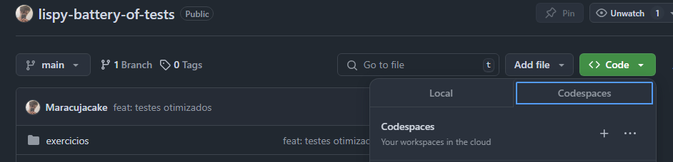
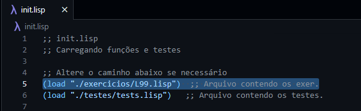

<h1 align="center">
    Lispy Battery of Tests
</h1>

    

## Introdução

Este repositório contém uma **bateria de testes e soluções** para os **exercícios da disciplina de Paradigmas de Linguagens de Programação (PLP)**. É um recurso útil para estudantes e entusiastas de Lisp que desejam praticar e testar suas habilidades.

## Instruções de Uso

**Clone o Repositório**:  
Abra o repositório no GitHub Codespaces ou clone-o na sua máquina utilizando o seguinte comando:

` git clone https://github.com/Maracujacake/lispy-battery-of-tests.git `

Outra alternativa é criar um codespaces no ambiente do repositório no github:

**Substitua as Soluções ou Crie as suas em outro arquivo**:  
Substitua as resoluções no arquivo `exercicios/L99.lisp` pelas suas próprias soluções para os exercícios.

É possível também criar outro arquivo `arquivo.lisp` e adicionar as soluções com os mesmos nomes descritos nos testes, ou então modificar o nome descrito nos testes para bater com o da sua função.
- Após isso, deve-se carregar o arquivo que implementou suas funções no arquivo `init.lisp` tal qual mostra a print abaixo:

**Modificar Testes**:  
Caso deseje adicionar ou modificar os testes, você pode encontrá-los no arquivo `testes/tests.lisp`.

**Executar os Testes**:  
Para executar os testes, basta invocar o arquivo `init.lisp` e, em seguida, rodar o script `./inicializacao.sh`. 

*Vale lembrar que testes novos devem ser adicionados ao init.lisp, visto que precisam ser chamados*

Se houver problemas de permissão com o script, você pode resolver isso com o seguinte comando:

`chmod +x inicializacao.sh`

*O que o script faz?*
- Ele executa o arquivo init.lisp (que invoca os testes criados pelo usuário) e printa sua saída em um arquivo output.txt. 
- Após isso, ele compila um arquivo .java que será responsável por contar quantos erros foram detectados e em quais exercícios.
- Executa então esse arquivo java mostrando no terminal o resultado.

## Contribuições

Contribuições são sempre bem-vindas! Se você tiver melhorias, correções ou novos testes para adicionar, fique à vontade para abrir um Pull Request.

---

**Nota**: Este repositório é destinado a fins educacionais e é um projeto aberto para aprendizado e prática de programação em Lisp.
